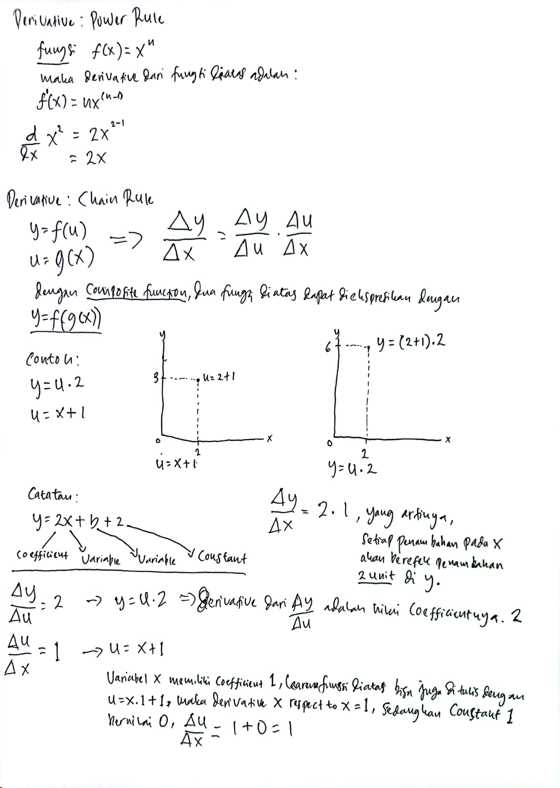
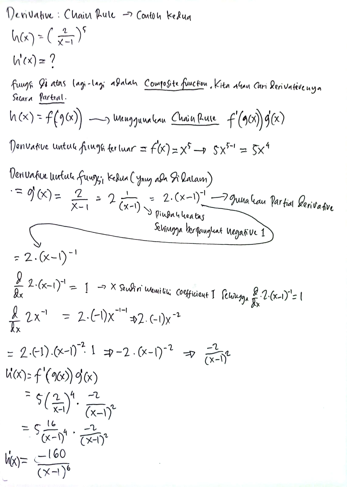
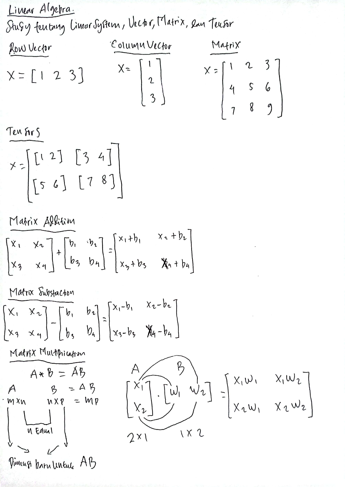
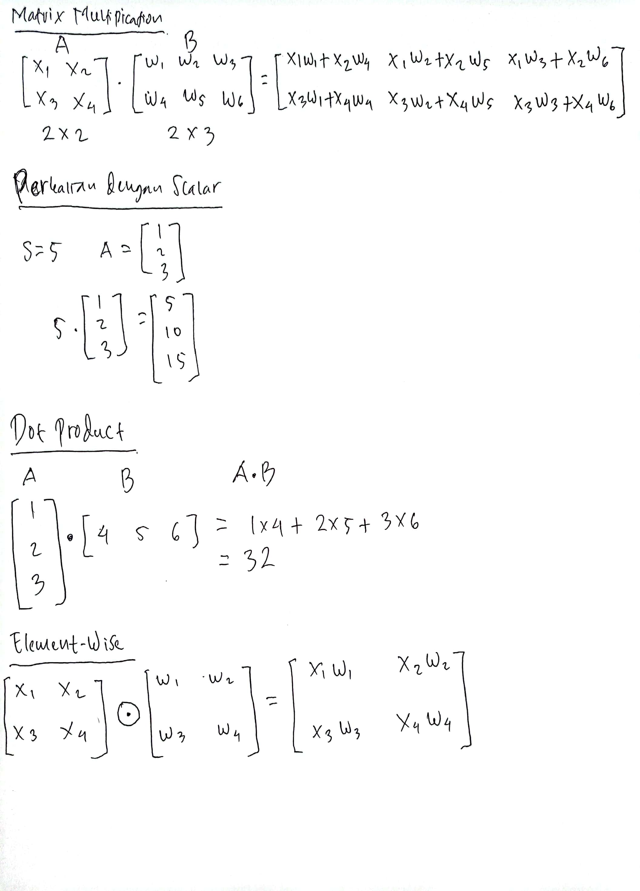
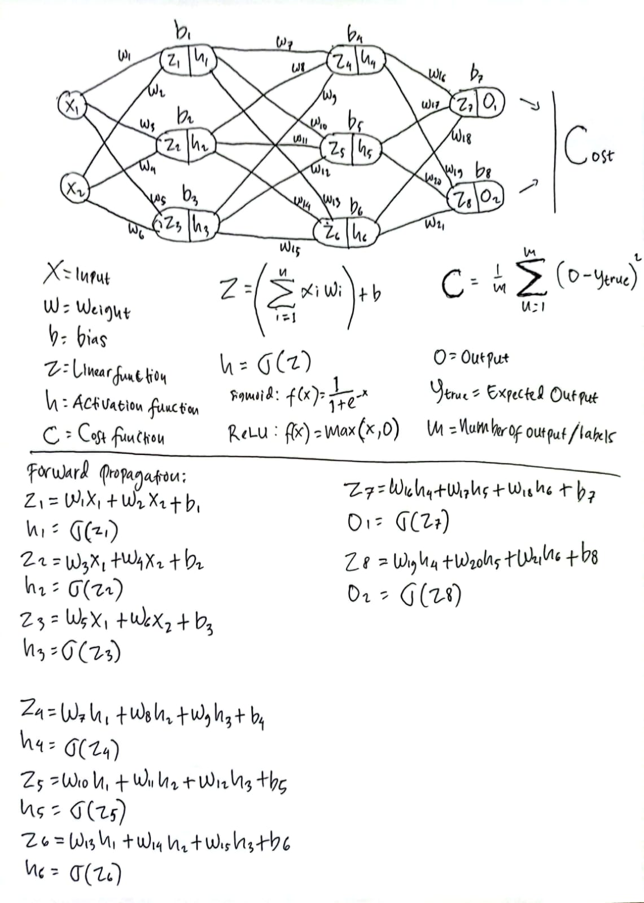
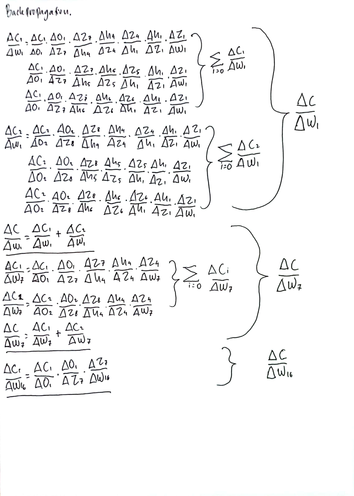
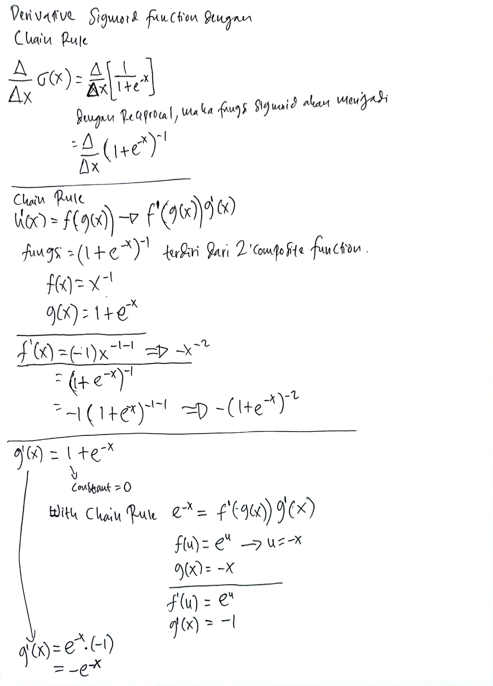
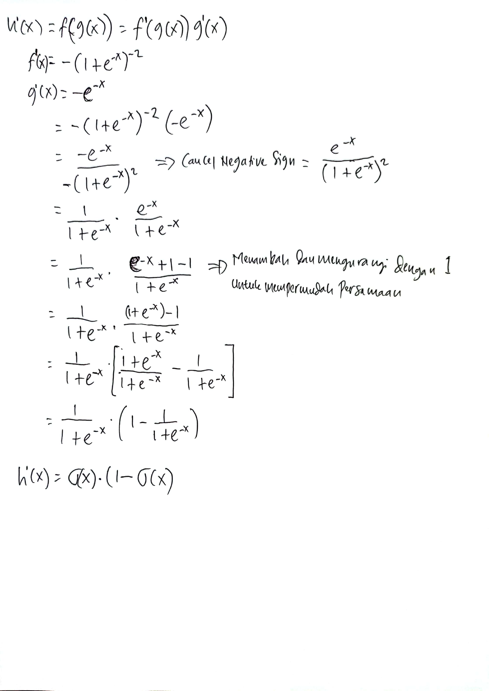
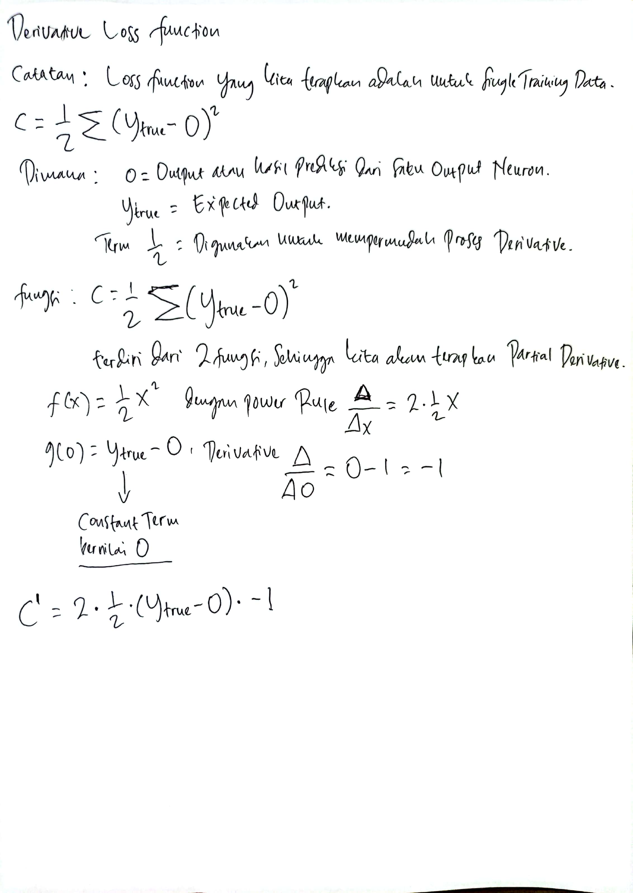
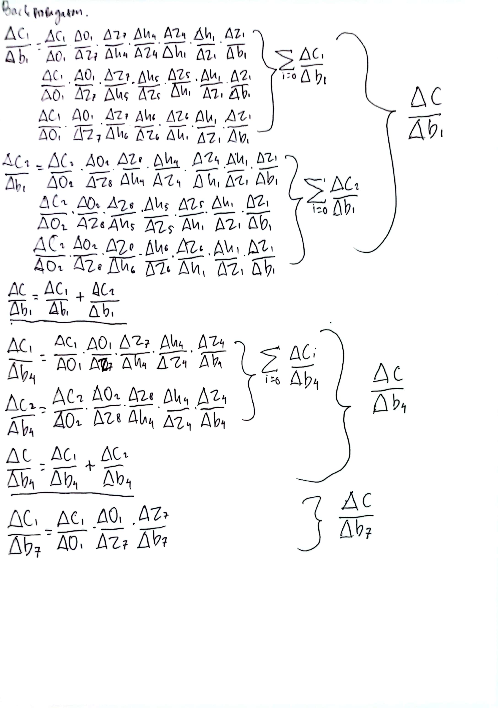

### Repository untuk research Neural Network from scratch dengan Javascript

https://wuriyanto48.github.io/nnjs/

### Download Dataset
https://drive.google.com/file/d/1t_4XPqk4p0-DBRTQV7BUSjK-kxKOKCte/view?usp=sharing

### Run Training
```shell
node nn_mnist_two_hidden_layer.js
```

Operasi diatas akan menghasilkan satu Machine Learning Model file `model.json` dalam format `JSON`. Yang Pada dasarnya file tersebut berisi `parameters` `weights` dan `biases` pada setiap layer.

### Inference
Untuk mencoba model yang telah terbentuk, salin file `model.json` ke folder `public/js`. Kemudian jalankan HTTP Server Inferencenya.
```
npm start
```

Atau anda bisa mencoba contoh yang sudah berjalan pada

https://wuriyanto48.github.io/nnjs/

### Linear Algebra, Calculus (Derivative, Partial Derivative, Chain Rule, Power Rule)

#### Chain Rule dan Power Rule
[](https://github.com/wuriyanto48)
<br/><br/>

#### Chain Rule contoh kedua
[](https://github.com/wuriyanto48)
<br/><br/>

#### Linear Algebra part 1
[](https://github.com/wuriyanto48)
<br/><br/>

#### Linear Algebra part 2
[](https://github.com/wuriyanto48)
<br/><br/>

#### Forward Propagation
[](https://github.com/wuriyanto48)
<br/><br/>

#### Gradient Descent
[](https://github.com/wuriyanto48)
<br/><br/>

#### Derivative dari fungsi Sigmoid part 1
[](https://github.com/wuriyanto48)
<br/><br/>

#### Derivative dari fungsi Sigmoid part 2
[](https://github.com/wuriyanto48)
<br/><br/>

#### Derivative dari fungsi Loss
[](https://github.com/wuriyanto48)
<br/><br/>

#### Backward Propagation part 1
[](https://github.com/wuriyanto48)
<br/><br/>

#### Backward Propagation part 2
[](https://github.com/wuriyanto48)
<br/><br/>